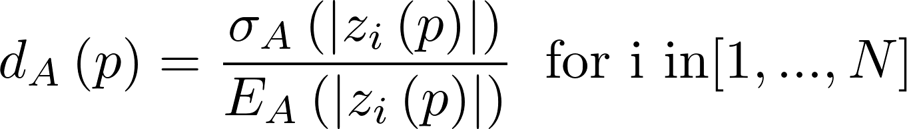

# Amplitude dispersion calculation module

This module estimates the mean amplitude and amplitude dispersion of each in a coregistered stack.

The stack is expected to be provided as a GDAL VRT file. The Metadata section of the input GDAL VRT may contain an amplitude calibration constant. If available, this calibration constant is applied before computation of mean amplitudes and dispersion.


## Algorithm

The mask dataset is an optional input and is often used to mask out water in the image. The mask dataset is interpreted as zero/ non-zero.

<p align="center">
  
</p> 

### References

1. Ferretti, A., Prati, C. and Rocca, F., 2001. Permanent scatterers in SAR interferometry. IEEE Transactions on geoscience and remote sensing, 39(1), pp.8-20.

2. Hooper, A. et al., 2009-2013.  StaMPS software. https://homepages.see.leeds.ac.uk/~earahoo/stamps/ .

## ampdispersion.py 

Python-based script that uses Cython-bound version of calamp.
Python-based executable will always have more error checking and better handling of optional inputs. 

```
usage: ampdispersion.py [-h] -i INPUTDS -o OUTPUTDS [-m MEANAMPDS]
                        [-l LINESPERBLOCK] [-r MEMORYSIZE] [-b REFBAND]

Compute amplitude dispersion and mean amplitude for stack of coregistered SLCs

optional arguments:
  -h, --help            show this help message and exit
  -i INPUTDS, --input INPUTDS
                        Input GDAL SLC stack VRT (default: None)
  -o OUTPUTDS, --output OUTPUTDS
                        Output amplitude dispersion dataset (default: None)
  -m MEANAMPDS, --mean MEANAMPDS
                        Output mean amplitude (default: )
  -l LINESPERBLOCK, --linesperblock LINESPERBLOCK
                        Quantum for block of lines (default: 64)
  -r MEMORYSIZE, --ram MEMORYSIZE
                        Memory in Mb to use (default: 256)
  -b REFBAND, --band REFBAND
                        Reference band to use for relative normalization
                        (default: 1)
```


## ampdispersion

C++ based executable. Not much error checking of inputs.

```
  ampdispersion {OPTIONS}

    Amplitude dispersion and mean amplitude calculator

  OPTIONS:

      -h, --help                        Display this help menu
      -i[inputDS*]                      Input Stack VRT
      -o[dispDS*]                       Output dispersion dataset
      -m[meanDS*]                       Mean amplitude dataset
      -l[linesperblock]                 Lines to read per block
      -s[memorysize]                    Memory in Mb
      -b[refband]                       Reference band for norm
```

