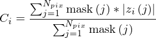

# Amplitude calibration module

This module estimates a calibration constant using the amplitude information for each SLC in a stack.
The stack is expected to be provided as a GDAL VRT file.
The Metadata section of the input GDAL VRT is updated with an amplitude calibration constant.


## Algorithm

The mask dataset is an optional input and is often used to mask out water in the image. The mask dataset is interpreted as zero/ non-zero.




### References

1. Lyons, S. and Sandwell, D., 2003. Fault creep along the southern San Andreas from interferometric synthetic aperture radar, permanent scatterers, and stacking. Journal of Geophysical Research: Solid Earth, 108(B1).

2. Hooper, A. et al., 2009-2013.  StaMPS software. https://homepages.see.leeds.ac.uk/~earahoo/stamps/ .


## calamp.py 

Python-based script that uses Cython-bound version of calamp.
Python-based executable will always have more error checking and better handling of optional inputs. 

```
usage: calamp.py [-h] -i INPUTDS -o OUTPUTDS [-m MASKDS] [-d DEFAULTVALUE]
                 [-l LINESPERBLOCK] [-r MEMORYSIZE] [-s]

Compute amplitude calibration using magnitude of SLCs

optional arguments:
  -h, --help            show this help message and exit
  -i INPUTDS, --input INPUTDS
                        Input GDAL SLC stack VRT (default: None)
  -o OUTPUTDS, --output OUTPUTDS
                        Output GDAL SLC stack VRT (default: None)
  -m MASKDS, --mask MASKDS
                        Mask DS to use for masking out water / other areas for
                        estimating calibration constant. (default: )
  -d DEFAULTVALUE, --default DEFAULTVALUE
                        Default value to assign to mask if a constant cannot
                        be computed (default: 1.0)
  -l LINESPERBLOCK, --linesperblock LINESPERBLOCK
                        Quantum for block of lines (default: 64)
  -r MEMORYSIZE, --ram MEMORYSIZE
                        Memory in Mb to use (default: 256)
  -s, --sqrt            Apply sqrt explicitly to the amplitudes (default:
                        False)
```


## calamp

C++ based executable. Not much error checking of inputs.

```
  calamp {OPTIONS}

    Amplitude calibration using magnitudes of SLCS.

  OPTIONS:

      -h, --help                        Display this help menu
      -i[inputDS*]                      Input Stack VRT
      -o[outputDS*]                     Output Stack VRT
      -m[maskDS]                        Mask dataset
      -l[linesperblock]                 Lines to load per block
      -r[memoryinMb]                    Memory to use in Mb
      -n[defaultValue]                  Default norm
```

