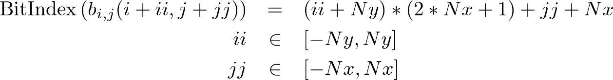
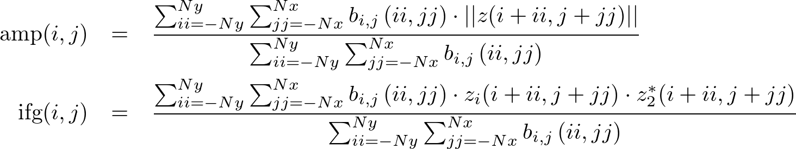

# Despeckling module

This module despeckles an SLC or a full resolution interferogram, using the local neighborhood of every pixel estimated by "nmap". The input is always a stack of SLCs, provided as a GDAL VRT file. The number of inputs provided to the "band" paramter determines if a despeckled amplitude / interferogram file is generated as output.


## Algorithm

The algorithm uses a simple weighted averaging, with weights being binary. The neighborhood is provided as a UInt32 file, where each bit in the band is interpreted as a weight between a pixel and its neighbor, i.e bit index corresponding to shift of ii lines and jj pixels is given by



where Ny and Nx represents the half-window size used to estimate the neighborhood.

The weighting is performed following:




### Future work
Note that it is possible to estimate self-similar neighbors using a much larger neighborhood using "nmap" and then use a smaller neighborhood for despeckling. "nmap" is a more computationally intensive operation and this flexibility will allow us to generate a single neighborhood map once and reuse it again for different applications with different neighborhoods or use an adapative neighborhood if needed.  This is currently not supported. Currently, the window sizes should match the ones used for nmap. 


### References

1. Ferretti, A., Fumagalli, A., Novali, F., Prati, C., Rocca, F. and Rucci, A., 2011. A new algorithm for processing interferometric data-stacks: SqueeSAR. IEEE Transactions on Geoscience and Remote Sensing, 49(9), pp.3460-3470.

2. Parizzi, A. and Brcic, R., 2011. Adaptive InSAR stack multilooking exploiting amplitude statistics: A comparison between different techniques and practical results. IEEE Geoscience and Remote Sensing Letters, 8(3), pp.441-445.


## despeck.py 

Python-based script that uses Cython-bound version of calamp.
Python-based executable will always have more error checking and better handling of optional inputs. 

```
usage: despeck.py [-h] -i INPUTDS -o OUTPUTDS [-w WTSDS] [-l LINESPERBLOCK]
                  [-r MEMORYSIZE] [-x HALFWINDOWX] [-y HALFWINDOWY]
                  [-b [BANDS [BANDS ...]]]

Despeckle SLC amplitude / single look interferogram

optional arguments:
  -h, --help            show this help message and exit
  -i INPUTDS, --input INPUTDS
                        Input GDAL SLC stack VRT (default: None)
  -o OUTPUTDS, --output OUTPUTDS
                        Output despeckled dataset (default: None)
  -w WTSDS, --wts WTSDS
                        Optional mask layer to speed up computation (default:
                        )
  -l LINESPERBLOCK, --linesperblock LINESPERBLOCK
                        Quantum for block of lines (default: 64)
  -r MEMORYSIZE, --ram MEMORYSIZE
                        Memory in Mb to use (default: 512)
  -x HALFWINDOWX, --xhalf HALFWINDOWX
                        Half window size (range) (default: 5)
  -y HALFWINDOWY, --yhalf HALFWINDOWY
                        Half window size (azimuth) (default: 5)
  -b [BANDS [BANDS ...]], --band [BANDS [BANDS ...]]
                        Single band for SLC despeckling and 2 bands for
                        interferogram (default: [])
  -c, --corr            Replace amplitude for despecked interferogram with
                        coherence (default: False)
```


## despeck

C++ based executable. Not much error checking of inputs.

```
  despeck {OPTIONS}

    Despeckle SLC magnitude/ IFG using a neighborhood mask

  OPTIONS:

      -h, --help                        Display this help menu
      -i[inputDS*]                      Input dataset
      -m[wgtsDS*]                       Input neighbor mask
      -o[outputDS*]                     Despeckled amplitude dataset
      -l[linesperblock]                 Lines per block for processing
      -r[memorysize]                    Memory in Mb
      -x[xsize]                         Half window in x
      -y[ysize]                         Half window in y
      -b[band...]                       Band index to use in SLC / IFG
      -c                                Replace amplitude with coherence
```

